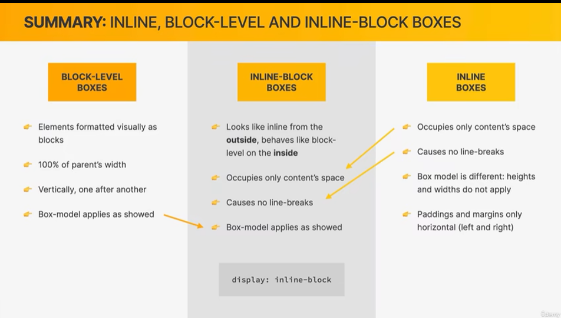

Web browers understand HTML and render HTML code as websites.

Opening tag+Content+Closing tag = Element

其实最开始是这样的顺序介绍element的，介绍HTML，Text Element，List Element，Img，Hyperlinks，Semantic html，

CSS讲解：介绍CSS，Styling Text，Selectors，Color，Pseudo-Classes，Styling Hyperlinks，Conflicts Between Selectors，Inheritance and the Universal Selector，The CSS Box Model，Centering our Page ，Types of Boxes，Absolute Positioning，Using Floats

# HTML

## Element

- `head`
  - `<link href="style.css" rel="stylesheet"></link>`:链接标签只有将HTML连接到CSS文件的唯一目的
  - `<meta charset="UTF-8">`
  - `title`
- `body`

### Block Element

- `h1~h6`,`p`
- `ol li ul`

#### h5提供

- `nav`,`header`,`article`,`footer`,`aside`
- `aside`：和主体相关的其他内容（侧边栏）

### Inline Element

- `b`,`i`
- `<a href="" target="_blank"></a>`:是`href`属性让它成为一个链接，否则它只是普通的锚元素

#### h5提供

- `strong`,`em`

### 替换Element

#### `img`

兼具行内和块状元素的特点，不独占一行，没有content，使用attribute

图片和外部容器的底部缝隙问题

```html
<style>
    .imgDiv {
        border: 5px seagreen solid;
    }

    .imgDiv img {
        width: 400px;
        height: 300px;
        /* 只要不是基线对齐，就能消除底部缝隙 */
        vertical-align: top;
        vertical-align: bottom;
        vertical-align: middle;
    }
</style>

<div class="imgDiv">
    
</div>
```

### Form

- `button` 按钮元素也可以有悬停状态，但它们没有link或者visited，inline-block默认有padding和border

# Casscading Style Sheets


## Property

**基础**

- `id`
- `class`

- `cursor` 鼠标移进样式
- `display`：`inline`,`block`,`inline-block`,`table`,`none`
- `text-decoration` 文本修饰

**字体**

- `font-size` default:16px
- `font-family`
- `text-transform`
- `font-style` italic斜体
- `text-align` 相对于父元素，文本的水平对齐
- `line-height` 行高，它会把除了字体本身大小以外多余的平均分配
  - 它的基准是字本身的大小，推荐使用数字设置
- `font-weight` bold
- `color` 字体颜色
- `letter-spacing` 字母间距 default:normal

**列表**

- `list-style`

**背景**

- `background-color`

**盒子**

- `margin` 如果我们设置的左和上外边距会移动元素自身，设置下和右外边距会移动其他元素
- `padding`
- `width`
- `height`
- `border` 其顺序是按顺时针方向设置的，剩下的可以由矩形的对称性推导出来
- `box-sizing` ：`content-box`，`border-box`就是width = width + padding+ border = element width

**定位**

- `position`
- `top`
- `right`
- `bottom`
- `left`

**浮动**

- `float`
- `clear` 清除浮动影响，(本质是为元素添加一个`margin-top`属性，值由浏览器自动计算）

### 继承

有的样式会被继承，一般是文字样式

## Selector

选择器有权重，继承的权重很低

### 选择器的权重

内联样式  1,0,0,0

id选择器  0,1,0,0

类和伪类选择器 0,0,1,0

元素选择器 0,0,0,1

通配选择器 0,0,0,0

继承选择器 没有优先级

### Single

**元素选择器**

elementname{}

```css
p{}
```

**类选择器**

.classname{} class中的值一般用`class="related-author`这种短横线风格

```css
.bule{}
```

**ID选择器**

#idname{}

```css
#red{}
```

**通用选择器**

适用于全部元素，但是不涉及继承，body也适用于基本全部元素，但一般放置涉及继承的

```css
*{}
```

### 复合选择器

**并集选择器**

同时选择多个选择器对应的元素

选择器1,选择器2,选择器3,选择器n{}

```css
h1,span{
    color: green;
}
```

### 关系选择器

- 父元素：直接包含子元素的元素叫做父元素

- 子元素：直接被父元素包含的元素是子元素

- 祖先元素：直接或间接包含后代元素的元素叫做祖先元素；一个元素的父元素也是它的祖先元素

- 后代元素：直接或间接被祖先元素包含的元素叫做后代元素；子元素也是后代元素

- 兄弟元素：拥有相同父元素的元素是兄弟元素

**后代元素选择器**

祖先 后代

```css
div span{}
```

### 伪类选择器pseudo-classes

- `:first-child` 第一个子元素
- `:link` 未访问的链接，有href属性的

- `:visited` 已访问的链接 
  - 由于隐私的原因，所以`visited`这个伪类只能修改链接的颜色

- `:hover` 鼠标悬停的链接

- `:active` 鼠标点击的链接

### 伪元素选择器

伪元素，表示页面中一些特殊的并不真实的存在的元素（特殊的位置）

- `::after` 元素的最后
- `::before` 元素的开始
- `::before`和`::after` 必须结合`content`属性来使用

## The Box Model

注意：这里Fill Area是包含padding的，所以有时候到底设置padding还是margin还是需要取舍的。


## Types of Boxes

**block-level element**

- Elements are formatted visually as blocks
- Elements occupy 100% of parent element's width,no matter the content
- Elements are stacked vertically by default, one after another
- The box-model applies as showed earlier

**inline boxes**

- Occupies only the space necessary for its content
- Causes no line-breaks after or before the element
- Box model applies in a different way:heights and widths do not apply(高度和宽度无用)
- Paddings and margins are applied only horizontally(left and right)（填充和边距只对左右起作用）

**注意**
在谷歌浏览器开发工具中，内联元素的盒子还是会把上下边距标识出来，但是它是无用的。


虽然这个元素填充了，但是它并没有创造新的空间。

通常，我们不会在元素上设置固定高度，因为你不能保证里面的元素的高度不会大于外面的元素。

内联元素块：外面看起来是内联，内部表现得像块级



这个有时候很重要，比如，你想它不换行，但是又想设置垂直方向的边距。

## Positioning

**Absolute Positioning**

绝对定位就是把元素从正常流中拿出来了，并且定位的基础是最近的相对定位的祖先元素。绝对定位一般用于小的功能，不要大范围使用绝对定位。

## Layout


### Float

本质是为了文字围绕图片四周，比如将`img`设置为`folat`，设置`float`之后会脱离文档流


# 技巧

## 居中

**需要区分是给block居中还是给inline居中**

将需要居中的内容放到一个容器元素中 put all of our content into a container element
这个容器需要有width
只是逻辑：the child element can never be wider than the parent element
在容器左边和右边添加margin ：margin-left:auto ,margin-right:auto, (shorthand简写)margin:0 auto

**如何让anchor element 居中**

add the `text-align` css properties to its parent style attribute

```html
<div class="my-class">
  <a href="http://www.baidu.com">example</a>
</div>


.my-class{
  text-align:center;
}
```

## 元素的white-space

所有元素都有white-space

```html
<style>
	.color{
        width: 22px;
        height: 22px;
        background-color: #000;
        display: inline-block;
    }
    .color-blue{
        background-color: #2f6ee2;
    }
    .color-red{
        background-color: #ec2f2f;
    }
    .color-yellow{
        background-color: #f0bf1e;
    }
    .color-green{
        background-color: #90cc20;
    }
    .color-brown{
        background-color: #885214;
    }
</style>
<div class="colors">
    <div class="color"></div>
    <div class="color color-blue"></div>
    <div class="color color-red"></div>
    <div class="color color-yellow"></div>
    <div class="color color-green"></div>
    <div class="color color-brown"></div>
</div>
```

这样之后可以看到div之间一排会有空隙，这是因为所有元素都自带的`white-space`属性在起作用。默认行为就是把换行变成空格。也就是这里的间隙实际上是来自div和div之间的换行转变成空格导致的。

## 清除浮动

子元素都设置了float，父元素高度塌陷

方式一：

在子元素兄弟位置后面新建一个空的 div 元素，然后设置它`clear:both`

方式二：

直接对父元素处理`class="clearfix"`

```css
​```css
.clearfix::after {
  clear:both;
  content:'';
  display: block;
}
​```
```

