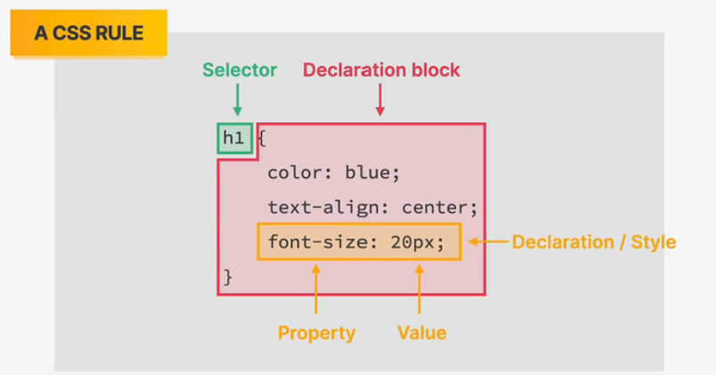
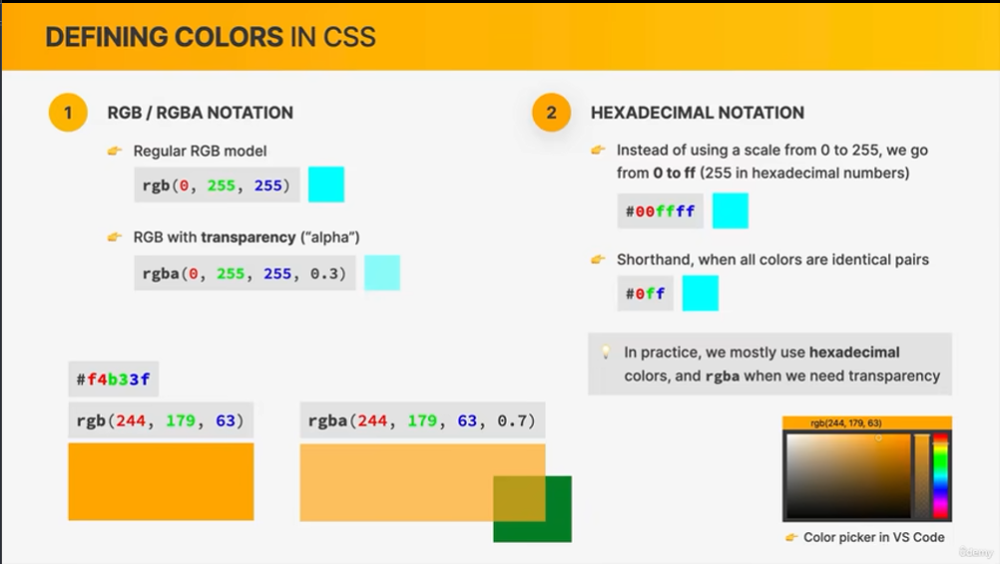

## 综述

- 01 WELCOME AND FIRST STEPS
- 02 HTML FUNDAMENTALS
- 03 CSS FUNDAMENTALS
- 04 BUILDING LAYOUTS
- 05 WEB DESING FRAMEWORK
- 06 COMPONENTS AND LAYOUTS
- 07 OMNIFOOD:DESKTOP
- 08 OMNIFOOD:RESPONSIVE
- 09 OMNIFOOD:OPTIMIZATIONS

### VSCODE
自定义编辑器(主要是为了和讲师的代码看起来一致)

扩展-prettier

扩展-one monokai

设置-设置 ： 
- defult formatter 选择prettier
- format on save 勾选复选框
- auto save :onFocusChange
- tab size:2

设置-文件图标主题：seti

静态文件：浏览器发送请求到服务器，服务器把静态html/css/js传给浏览器，然后解析。

## 06 your very fitst webpage
01-TEST index.html

## 07 downloading course material
https://github.com/jonasschmedtmann/html-css-course

## 08 watch before your start
最开始不理解是很正常的，继续关注，继续练习。必须自己编代码，不要只看。

## 09 section intro
正式进入课程

## 10 introduction to html
- HyperText Markup Language
- HTML is a markup language that web developers use to structure and describe the content of a webpage(not a programming language)
- HTML consist of elements that describe different types of content: paragraphs,links,headings,images,video,etc.
- Web browers understand HTML and render HTML code as websites


## 11 html document structure
02-HTML FUNDAMENTALS

`<!doctype html> <html> <head> <title> <body> <h1> `

### VSCODE
设置-auto closing tags

## 12 text elements

`h1 h2 h3 p`
`b i`太旧了
HTML5:`strong em`
h1最好只有一个。

## 13 more text elements_lists
`ol li ul`


## 14 images and attributes
`img`: no content ,it uses attributes 
- src
- alt
- width
- height

`html` :lang
`meta`:charset="UTF-8"
## 15 hyperlinks


`a` 是锚元素，可以指向内部和外部
- href 是这个元素让它成为一个链接，否则它只是普通的锚元素
- target="_blank"


## 16 structuring our page 
`nav header article footer`

实体： `&copy;`&copy;


## 17 a note on semantic html

语义html:搜索引擎优化

## 18 installing additional vs code extension
### VSCODE

扩展 image preview
扩展 color highlight和CSS有
扩展 auto rename tag

设置-设置-auto closing tags 勾选

扩展 live server

## 19 challenge #1 
将图片整体放入img文件夹

`aside`

## 20 challenge #2
https://codepen.io/ 编写代码练习

## 21 Section Intro

## 22 Introduction to CSS
- Casscading Style Sheets
- CSS describes the visual style and presentation of the content wirtten in HTML
- CSS consists of countless properties that developers use to format the concent:properties about font,text,spacing,layout ,etc.


## 23 Inline,Internal and External CSS
使用上一部分结束的代码继续继续这一小节的学习
```html
<h1 style="color:blue"></h1>
```
Internal
```html
<head>
    <style>
        h1 {
            color:blue;
        }
    </style>
</head>
```
External:链接标签只有将HTML连接到CSS文件的唯一目的
```html
<head>
    <link href="style.css" rel="stylesheet"></link>
</head>
```

## 24 Styling Text 
不是靠去记这些属性，而是要学会多用，重复。
```css
h1 {
    /* 字体大小 */
    font-size:26px;
    /* 字体样式 但是不能使用你本机安装的字体，页面是要给别人看的*/
    font-family:sans-serif;
    /* 文本变换 */
    text-transform:uppercase;
    /* 字体样式 斜体 */
    font-style:italic;
    /* 文本居中，相对于父元素 */
    text-align:center;
}

p{
    /* 行高 */
    line-height:1.5
}
```
li 默认font-size是16px

## 25 Combining Selectors
```css
/* h1或者h2或者h3   并集选择 */
h1,h2,h3{

}
/* 后代选择器 */
footer p{}
```
但是这种elements选择器范围太大了

## 26 Class and ID Selectors
attrbuites:id,class
class中的值一般用`class="related-author`这种短横线风格

```css
.related-author{
    /* 字体的粗细程度 */
    font-weight:bold
}

ul{
    /* 删除项目列表样式 */
    list-style:none;
}
```
尽量多可能使用class属性而不是id属性


## 27 Working with colors


十六进制：FF表示255



一般用十六进制，需要透明度就使用RGB


灰色是所有通道都是一样的值

```css
p{
    color:blue;
    background-color: #f7f7f7;
    border: 5px solid #1098ad
}
```

## 28 pseudo-classes
伪类
```css
li:first-child{
    font-style:italic
}
```

## 29 styling hyperlis
```css
/* a有href属性的 */
a:link{
    color:#1098ad;
    text-decoration:none;
}
/* 访问 */
a:visited{
    color:#777
}
/* 悬停 */
a:hover{
    color:orangered;
}
/* 活跃 */
a:active{

}
```

## 30 using chrome devtools

user agent stylesheet基本表示默认样式

还可以点击`a`，看到有伪造悬停等


## 31 CSS theory1 Conflicts between selectors


## 032 CSS Theory #2_ Inheritance and the Universal Selector
文字属性基本会被继承，继承的优先级很低。

通用选择器

## 33 challenge1

## 34 CSS Theory #3_ The CSS Box Model


## 35 using margins and paddings

边距收缩：取其大


## 36 adding dimensions
width and height 

percentage:父元素的百分比

## 37 centering our 
元素居中


## 38 challange2

## 039 CSS Theory #4_ Types of Boxes

block-level element 
inline boxes:only occupy the content

块级元素
- Elements are formatted visually as blocks
- Elements occupy 100% of parent element's width,no matter the content
- Elements are stacked vertically by default, one after another
- The box-model applies as showed earlier

除了本身是块级元素外，我们也可以使用CSS让元素变成块级元素
```css
display :block
```

内联元素
- Occupies only the space necessary for its content
- Causes no line-breaks after or before the element
- Box model applies in a different way:heights and widths do not apply(高度和宽度无用)
- Paddings and margins are applied only horizontally(left and right)（填充和边距只对左右起作用）

转化成inline
```css
display :inline
```
**注意**
在谷歌浏览器开发工具中，内联元素的盒子还是会把上下边距标识出来，但是它是无用的。


虽然这个元素填充了，但是它并没有创造新的空间。

通常，我们不会在元素上设置固定高度，因为你不能保证里面的元素的高度不会大于外面的元素。

内联元素块：外面看起来是内联，内部表现得像块级


这个有时候很重要，比如，你想它不换行，但是又想设置垂直方向的边距。
img就是一个内联块元素


## 040 CSS Theory #5_ Absolute Positioning


正常流就是相对定位，绝对定位就是把元素从正常流中拿出来了，并且定位的基础是最近的相对定位的祖先元素。


绝对定位一般用于小的功能，不要大范围使用绝对定位。


## 041 Pseudo-elements
表情符号：windos+.


## 042 Developer Skill #1_ Googling and Reading Documentation
谷歌搜索问题
stackoverflow 
mdn
居中anchor元素

## 043 Developer Skill #2_ Debugging and Asking Questions
工具
html validator，
diffchecker.com


## 044 CHALLENGE #3


为了绝对定位，请先确定相对定位的元素

调整字母间距：letter-spacing