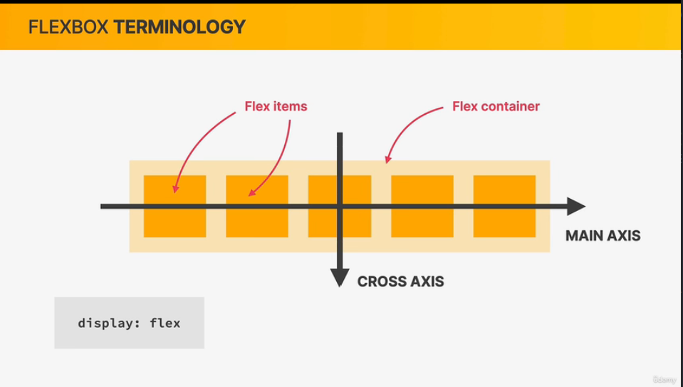

# 04 BUILDING LAYOUTS

## 046 The 3 Ways of Building Layouts


现在，flex 和 grid 布局已经是最新的布局方式，后面在项目中我们会大量使用，但是现在，我们先学习 float

## 047 Using Floats

### vscode

输入 lorem vscode 会创造一段假文本

```


<p id="author" class="author">
  Posted by <strong>Laura Jones</strong> on Monday, June 21st 2027
</p>

.author-img {
  float: left;
}

.author {

}
```

文字会围绕图片,通过检查元素，会发现 p 标签实际上是在最左边的，只有将.author 也设置成`float:left`，就会发现 p 和 img 并排了


## 048 Clearing Floats

子元素全部设置了 float，同时父元素没有 width,所以会出现父元素高度塌陷问题

方式一：
在子元素兄弟位置后面新建一个空的 div 元素，然后设置它`clear:both`
但是这样不好，这样会多很多 empty 的 div 元素

方式二：
在父元素 添加`class="clearfix"`，然后设置 clearfix 类的属性
其实和方式一一样，就是在最后添加一个空的元素，但是请注意::before 和::after 都是 inline elements,而 clear floats 只适用于 block-level element

## 049 Building a Simple Float Layout

在布局的时候可以把背景颜色设置，so we can actually see what is happening

```css
/* 在布局的时候先把背景颜色标出，这样能明显看到我们到底在干什么 */
article {
  background-color: green;
  width: 900px;
  float: left;
}

aside {
  background-color: red;
  width: 300px;
  float: right;
}

footer {
  background-color: yellow;
}
```

这里，很奇怪的是，footer 在 aside 下面。

解答：其实这里不是footer在aside下面，是因为有文字的原因，CSS虽然受浮动的影响，应该脱离文档流，但是对于文字而言，它似乎是会怎么都会展示出来。如果footer单纯只是个单纯的div块，你就会发现它是符合想象中的文档流位置。


这里就是元素受到了浮动元素的影响，所以需要清除！。

在上面那个例子中，因为没有多余清除浮动影响的元素，所以我们需要创建，而在这个例子中，footer 元素就是可以那个需要清除浮动影响的元素，所以我们不需要再创建了。

```css
footer {
  clear: both;
}
```

## 050 box-sizing\_ border-box

内部空间空应该首选 padding


## 051 CHALLENGE #1

## 052 Introduction to Flexbox

复制 starter-flex 和 css

## 053 A Flexbox Overview

WHAT IS FLEXBOX

- Flexbox is a set of related CSS properties for building 1-dimensional/dai/ layouts
- The main idea behind flexbox is that empty space inside a container element can be automatically divided by its child elements
- Flexbox makes it easy to automatically align items to one another inside a parent container,both horizontally and vertically
- Flexbox solves common problems such as vertical centering and creating equal-height columns
- Flexbox is perfect for replacing floats ,allowing us to write fewer and cleaner HTML and CSS code

flex-container and flex-items,

the direction in which these flex items are laid out is called the main axis



牢记！！！


## 054 Spacing and Aligning Flex Items

弹性项目之间的间距
flex-container{
gap:1px
}

## 055 The flex Property

flex property is actually a shorthand :flex-grow
flex :这里真的只是触及表面，所以并不希望你完全了解什么。

## 056 Adding Flexbox to Our Project

gap 属性可能有的浏览器不支持

## 057 Building a Simple Flexbox Layout

将项目中的文章与帖子并排

## 058 CHALLENGE #2

## 059 Introduction to CSS Grid

```
display: none
```

grid

```
{
  display: grid;
  grid-template-columns: 250px 200px 100ox 100px;
  grid-template-rows: 300px 200px;
  /* 和grid-gap一样 */
  gap: 30px;
  column-gap: 30px;
  row-gap: 60px;
}
```

## 060 A CSS Grid Overview

- CSS Grid is a set of CSS properties for building 2-dimensional layouts
- The main idea behind CSS Grid is that we divide a container element into rows and columns that can be filled with its child elements
- In two-dimensional contexts,CSS Grid allows us to write less nested HTML and easier-to-read CSS
- CSS Grid is not meant to replace flexbox ! Instead,the work perfectly together.Need a ID layout?Use flexbox,Need 2D layout? Use CSS Grid.


与 flex 不同的是，Grid 的轴的方向是不能被改变的，但这其实使得它的使用更简单了，不是吗？


有大量 Grid 相关属性不会在这个课程出现。


## 061 Sizing Grid Columns and Rows

fr unit instead of px，只有在网格的大小固定不变的情况下使用 px,fr 会去适应所能用的空间

## 062 Placing and Spanning Grid Items

grid-column
grid-row

每个 grid 中网格线实际有正反两套数字在标记。

## 063 Aligning Grid Items and Tracks

用 container2 做实验
justify-content
align-content

align-self
justify-self

## 064 Building a Simple CSS Grid Layout

## 065 CHALLENGE #3
