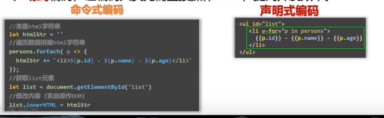

# Vue-尚硅谷课程

总体

- vue基础
- vue-cli
- vue-router
- vuex
- element-ui
- vue3

# 第一章 Vue核心

## 1.1、Vue简介

### 1.1.1、Vue是什么

一套用于构建用户界面（即：将拿到的数据通过某种方式变成用户看到的界面）的渐进式JS框架。

渐进式：Vue可以自底向上逐层的应用

	- 简单应用：只需要一个轻量小巧的核心库
	- 复杂应用：可以引入各种各样的Vue插件

### 1.1.3、特点

1、采用组件化模式，提高代码复用率、且让代码更好维护；（xx.vue包含html/css/js）

2、声明式编码，让编码人员无需直接操作DOM，提高开发效率；

3、使用虚拟DOM+优秀的Diff算法，尽量复用DOM节点；（原来的js展示数据，每次都要重新渲染，或者是自己也可以比较，但是diff算法不好。）

vue实现：

4、学习Vue之前要掌握的JS基础知识

ES语法规范、ES6模块化、包管理器、原型、原型链、数组常用方法、axios、promise

## 1.2、Vue官网

导航栏：

学习-教程（官方出的入门文档）和API（Vue的字典）是最重要的两个，风格指南（Vue推荐的写法），Cookbook（Vue推荐的小技巧）

生态-工具和核心插件

资源-Awesome vue.js（别人写好的三方库，比如报表）