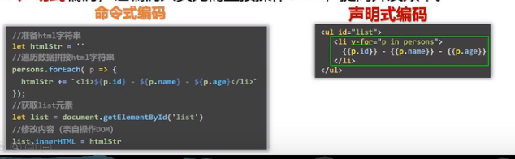

# Vue-尚硅谷课程

总体

- vue基础
- vue-cli
- vue-router
- vuex
- element-ui
- vue3

# 第一章 Vue核心

## 1.1、Vue简介

### 1.1.1、Vue是什么

一套用于构建用户界面（即：将拿到的数据通过某种方式变成用户看到的界面）的渐进式JS框架。

渐进式：Vue可以自底向上逐层的应用

	- 简单应用：只需要一个轻量小巧的核心库
	- 复杂应用：可以引入各种各样的Vue插件

### 1.1.3、特点

1、采用组件化模式，提高代码复用率、且让代码更好维护；（xx.vue包含html/css/js）

2、声明式编码，让编码人员无需直接操作DOM，提高开发效率；



3、使用虚拟DOM+优秀的Diff算法，尽量复用DOM节点；（原来的js展示数据，每次都要重新渲染，或者是自己也可以比较，但是diff算法不好。）


vue实现：


4、学习Vue之前要掌握的JS基础知识

ES语法规范、ES6模块化、包管理器、原型、原型链、数组常用方法、axios、promise

### 1.1.3、Vue官网

https://cn.vuejs.org

导航栏：

学习-教程（官方出的入门文档）和API（Vue的字典）是最重要的两个，风格指南（Vue推荐的写法），Cookbook（Vue推荐的小技巧）

生态-工具和核心插件

资源-Awesome vue.js（别人写好的三方库，比如报表）

## 1.2、初识 Vue

### 1.2.1、js引入Vue

```js
<!-- 引入Vue，引入了以下js之后，全局就多了一个Vue对象 -->
    <script type="text/javascript" src="../js/vue.js"></script>
```

直接引入之后，控制台会出现警告


然后浏览器添加扩展小工具

vue_dev_tools.crx


```js
<script type="text/javascript" >
    Vue.config.productionTip = false //阻止 vue 在启动时生成生产提示。
</script>
```

要使用Vue，需要new Vue()，然后才能开启使用Vue

```js
new Vue({
    el:'#demo', //el用于指定当前Vue实例为哪个容器服务，值通常为css选择器字符串。
    data:{ //data中用于存储数据，数据供el所指定的容器去使用，值我们暂时先写成一个对象。
        name:'atguigu',
        address:'北京'
    }
})
```

### 1.2.2、Vue的使用

初识Vue：

- 1.想让Vue工作，就必须创建一个Vue实例，且要传入一个配置对象；
- 2.root容器里的代码依然符合html规范，只不过混入了一些特殊的Vue语法；
- 3.root容器里的代码被称为【Vue模板】；
- 4.<font color='red'>Vue实例和容器是一一对应的</font>；
- 5.真实开发中只有一个Vue实例，并且会配合着组件一起使用；
- 6.{{xxx}}中的xxx要写**js表达式**，且xxx可以自动读取到data中的所有属性；
- 7.一旦data中的数据发生改变，那么页面中用到该数据的地方也会自动更新；

注意区分：js表达式 和 js代码(语句)

​            1.表达式：一个表达式会产生一个值，可以放在任何一个需要值的地方：

​                  (1). a

​                  (2). a+b

​                  (3). demo(1)

​                  (4). x === y ? 'a' : 'b'

​            2.js代码(语句)

​                  (1). if(){}

​                  (2). for(){}


## 1.3、模板语法

主要分为两类：插值语法和指令语法

Vue模板语法有2大类：

​          1.插值语法：

​              功能：用于解析标签体内容。

​              写法：{{xxx}}，xxx是js表达式，且可以直接读取到data中的所有属性。

​          2.指令语法：

​              功能：用于解析标签（包括：标签属性、标签体内容、绑定事件.....）。

​              举例：v-bind:href="xxx" 或 简写为 :href="xxx"，xxx同样要写js表达式，

​                   且可以直接读取到data中的所有属性。

​              备注：Vue中有很多的指令，且形式都是：v-????，此处我们只是拿v-bind举个例子。

## 1.4、数据绑定

Vue中有2种数据绑定的方式：

​          1.单向绑定(v-bind:)：数据只能从data流向页面。

​          2.双向绑定(v-model:)：数据不仅能从data流向页面，还可以从页面流向data。

​            备注：

​                1.<font color = 'red'>双向绑定一般都应用在表单类元素上</font>（如：input、select等）

​                2.v-model:value 可以简写为 v-model，因为v-model默认收集的就是value值。

## 1.5、el与data的两种写法


data与el的2种写法

​          1.el有2种写法

​                  (1).new Vue时候配置el属性。

​                  (2).先创建Vue实例，随后再通过vm.$mount('#root')指定el的值。

​          2.data有2种写法

​                  (1).对象式

​                  (2).函数式

​                  如何选择：目前哪种写法都可以，以后学习到组件时，data必须使用函数式，否则会报错。

​          3.一个重要的原则：

​                  由Vue管理的函数，一定不要写箭头函数，一旦写了箭头函数，this就不再是Vue实例了。

## 1.5 MVVM模型

1. M：模型(Model) ：data中的数据

2. V：视图(View) ：模板代码

3. VM：视图模型(ViewModel)：Vue实例


观察发现：

1.data中所有的属性，最后都出现在了vm身上。

2.vm身上所有的属性 及 Vue原型上所有属性，在Vue模板中都可以直接使用。

## 1.6、数据代理

### 1.6.1、Object.defineProperty（）


```js
let number = 18
//这种方式是可以被遍历的
let person = {
    name:'张三',
    sex:'男',
}
//给某个对象添加属性  对象，属性，配置项（可以控制属性的各种配置项）
Object.defineProperty(person,'age',{
    // value:18,
    // enumerable:true, //控制属性是否可以枚举，默认值是false
    // writable:true, //控制属性是否可以被修改，默认值是false
    // configurable:true //控制属性是否可以被删除，默认值是false

    //当有人读取person的age属性时，get函数(getter)就会被调用，且返回值就是age的值
    get(){
        console.log('有人读取age属性了')
        return number
    },

    //当有人修改person的age属性时，set函数(setter)就会被调用，且会收到修改的具体值
    set(value){
        console.log('有人修改了age属性，且值是',value)
        number = value
    }

})
console.log(Object.keys(person))
```

### 1.6.2、数据代理

数据代理：通过一个对象代理对另一个对象中属性的操作（读/写）

1.Vue中的数据代理：

​              通过vm对象来代理data对象中属性的操作（读/写）。把data里面的数据放到vm了一份

2.Vue中数据代理的好处：

​              更加方便的操作data中的数据

 3.基本原理：

​              通过Object.defineProperty()把data对象中所有属性添加到vm上。

​              为每一个添加到vm上的属性，都指定一个getter/setter。

​              在getter/setter内部去操作（读/写）data中对应的属性。

如果没有数据代理，获取数据不能直接vm.属性了，需要vm._data.属性。

（注意，谷歌浏览器的console的vm中的_data有数据劫持（为了实现data中的数据改变页面也改变））

## 1.6、事件处理

### 1.6.1、基本使用

事件的基本使用：

​              1.使用v-on:xxx 或 @xxx 绑定事件，其中xxx是事件名；

​              2.事件的回调需要配置在methods对象中，最终会在vm上；

​              3.methods中配置的函数，不要用箭头函数！否则this就不是vm了；

​              4.methods中配置的函数，都是被Vue所管理的函数，this的指向是vm 或 组件实例对象；

​              5.@click="demo" 和 @click="demo($event)" 效果一致，但后者可以传参；

### 1.6.2、事件修饰符

Vue中的事件修饰符：

​            1.prevent：阻止默认事件（常用）；

​            2.stop：阻止事件冒泡（常用）；

​            3.once：事件只触发一次（常用）；

​            4.capture：使用事件的捕获模式；

​            5.self：只有event.target是当前操作的元素时才触发事件；

​            6.passive：事件的默认行为立即执行，无需等待事件回调执行完毕；

### 1.6.3、键盘事件

1.Vue中常用的按键别名：

​              回车 => enter

​              删除 => delete (捕获“删除”和“退格”键)

​              退出 => esc

​              空格 => space

​              换行 => tab (<font color='red'>特殊，要配合配合keydown去使用</font>)

​              上 => up

​              下 => down

​              左 => left

​              右 => right

​        2.Vue未提供别名的按键，可以使用按键原始的key值（就是event.key）去绑定，但注意要转为kebab-case（短横线命名）

​        3.系统修饰键（用法特殊）：ctrl、alt、shift、meta

​              (1).配合keyup使用：按下修饰键的同时，再按下其他键，随后释放其他键，事件才被触发。

​              (2).配合keydown使用：正常触发事件。

​        4.也可以使用keyCode去指定具体的按键（不推荐）

​        5.Vue.config.keyCodes.自定义键名 = 键码，可以去定制按键别名

## 1.7、计算属性 computed

1. 要显示的数据不存在，要通过计算得来。 

2. 在 computed 对象中定义计算属性。 

3. 在页面中使用{{方法名}}来显示计算的结果。

```js
const vm = new Vue({
    ······
    computed:{
        // 用计算属性比methods好的地方有：计算属性会读取缓存，而methods每次都会调用
        fullName:{
            //get有什么作用？当有人读取fullName时，get就会被调用，且返回值就作为fullName的值
            //get什么时候调用？1.初次读取fullName时。2.所依赖的数据发生变化时。
            get(){
                console.log('get被调用了')
                // console.log(this) //此处的this是vm
                return this.firstName + '-' + this.lastName
            },
            //set什么时候调用? 当fullName被修改时。如果不需要set，可以不写，但是get是必须的
            set(value){
                console.log('set',value)
                const arr = value.split('-')
                this.firstName = arr[0]
                this.lastName = arr[1]
            }
        },
            //简写 ，确定计算属性只读不改，就可以用简写形式了
        fullName(){
            console.log('get被调用了')
            return this.firstName + '-' + this.lastName
        }
    }
    
    
})
```

## 1.7、监视属性

1. 通过通过 vm 对象的$watch()或 watch 配置来监视指定的属性 

2. 当属性变化时, 回调函数自动调用, 在函数内部进行计算

```js
const vm = new Vue({
    ······
    watch:{
        isHot:{
            //监视属性：主要用于需要新旧值的时候
            immediate:true, //初始化时让handler调用一下
            //handler什么时候调用？当isHot发生改变时。
            handler(newValue,oldValue){
                console.log('isHot被修改了',newValue,oldValue)
            }
        },
        //简写，当配置项只有handler时
        isHot(newValue,oldValue){
            console.log('isHot被修改了',newValue,oldValue,this)
        } 
    } 
})
//这种方式的watch ,被监视的属性要用''才可以。其实写在vm里面的watch 的属性也应该用''，但是可以省略
vm.$watch('isHot',{
    deep:true,
    immediate:true, //初始化时让handler调用一下
    //handler什么时候调用？当isHot发生改变时。
    handler(newValue,oldValue){
        console.log('isHot被修改了',newValue,oldValue)
    }
})
//简写
vm.$watch('isHot',function(){
    console.log('isHot被修改了',newValue,oldValue,this)
})
```

### 1.7.1、重要原则！！！

1.所被Vue管理的函数，最好写成普通函数，这样this的指向才是vm 或 组件实例对象。

2.所有不被Vue所管理的函数（定时器的回调函数、ajax的回调函数等、Promise的回调函数），最好写成箭头函数，这样this的指向才是vm 或 组件实例对象。

3.箭头函数不会创建this!!!

# 第 2 章：Vue 组件化编程

## 2.1 模块与组件、模块化与组件化

### 2.1.1. 模块

 理解: 向外提供特定功能的 js 程序, 一般就是一个 js 文件

为什么: js 文件很多很复杂  

作用: 复用 js, 简化 js 的编写, 提高 js 运行效率 

### 2.1.2. 组件

理解: 用来实现局部(特定)功能效果的代码集合(html/css/js/image…..)，包含html\css\js等，它是一个完整的功能。

为什么: 一个界面的功能很复杂

作用: 复用编码, 简化项目编码, 提高运行效率

### 2.1.3. 模块化

当应用中的 js 都以模块来编写的, 那这个应用就是一个模块化的应用。

### 2.1.4. 组件化

当应用中的功能都是多组件的方式来编写的, 那这个应用就是一个组件化的应用,。

## 2.2. 非单文件组件

一个文件中包含有n个组件

1. 模板编写没有提示 

2. 没有构建过程, 无法将 ES6 转换成 ES5 

3. 不支持组件的 CSS 

4. 真正开发中几乎不用 

```js
/*
1、创建组件
2、注册组件（分为局部和全局）
3、编写组件标签
*/
const school = Vue.extend({
    template:`
<div class="demo">
<h2>学校名称：{{schoolName}}</h2>
<h2>学校地址：{{address}}</h2>
<button @click="showName">点我提示学校名</button>	
</div>
`,
    // 组件里面要用函数的写法！！！
    data(){
        return {
            schoolName:'尚硅谷',
            address:'北京昌平'
        }
    }
})

Vue.component('hello',hello)

new Vue({
    el:'#root',
    data:{
        msg:'你好啊！'
    },
    //第二步：注册组件（局部注册）
    components:{
        school,
        student
    }
})
```

组件里面要用函数的写法，因为函数返回每次返回的是新的一个对象，如果用对象形式，用到组件的地方都用的是同一个对象！


## 2.3. 单文件组件

一个文件中只包含有一个组件

### 2.3.1. 一个.vue 文件的组成(3 个部分)

**1. 模板页面** 

```vue
<template> 

页面模板 

</template>
```


**2. JS 模块对象** 

```vue
<script> 

export default { 

data() {return {}}, 

methods: {}, 

computed: {}, 

components: {} 

}

</script> 
```


**3. 样式**

```vue
<style> 

样式定义 

</style> 
```

vscode 插件 ： vetur

**这里需要JS模块化的知识**

### 2.3.2. 基本使用

1. 引入组件 

2. 映射成标签 

3. 使用组件标签

# 第 3 章：使用 Vue 脚手架

## 3.1 初始化脚手架 vuecli (command line interface)

### 3.1.1

**说明** 

1. Vue 脚手架是 Vue 官方提供的标准化开发工具（开发平台）。 

2. 最新的版本是 4.x。 

3. 文档: https://cli.vuejs.org/zh/。

### 3.1.2 具体步骤 

第一步（仅第一次执行）：全局安装@vue/cli。 

```cmd
npm install -g @vue/cli 
```


第二步：切换到你要创建项目的目录，然后使用命令创建项目 

```cmd
vue create xxxx 
```


第三步：启动项目 

```cmd
npm run serve 
```


备注：

1. 如出现下载缓慢请配置 npm 淘宝镜像：

   ```cmd
   npm config set registry https://registry.npm.taobao.org
   ```

   

2. Vue 脚手架隐藏了所有 webpack 相关的配置，若想查看具体的 webpakc 配置， 请执行：

   ```cmd
   vue inspect > output.js
   ```

   